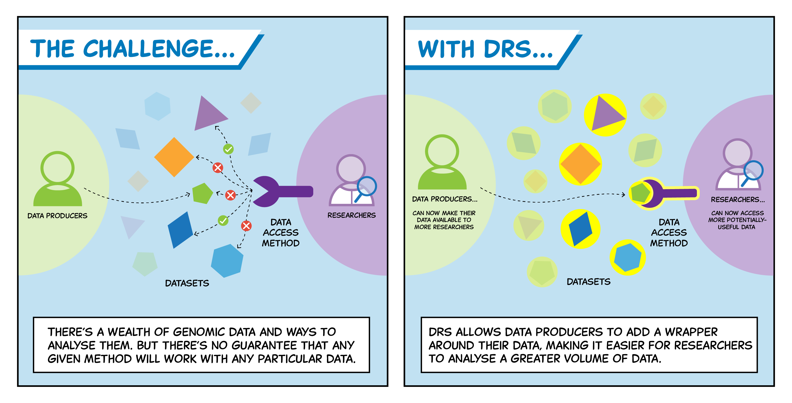

## Why Do We Need a Data Repository Service (DRS)?

As a researcher, imagine the frustration of trying to access data from multiple repositories for your project. You might need to install various data transfer tools, which can be especially challenging if you're analysing data on an institutional HPC or cloud environment. This is where a Data Repository Service (DRS) comes in handy!

Data repositories worldwide have diverse data architectures and access services, often creating their own tools for data access and transfer. This lack of standardisation makes it difficult for researchers to access data from multiple sources, as they may require multiple tools to pull the data.

*Source: [GA4GH DRS API](https://www.ga4gh.org/product/data-repository-service-drs/)*

## What is a DRS?

A Data Repository Service addresses this issue by providing a standardised method of data access through a common API. By eliminating the need for data providers to create their own data access tools, DRS allows researchers to access data repositories regardless of the underlying architecture.

## How Does a DRS Service Work?

Like many RESTful APIs, DRS manages authentication and authorization via an API access key. Data providers index data objects, and a DRS address containing a logical identifier (ID) is created. Researchers can then submit an access request using this ID. If the request is authenticated, the data is transferred via the HTTPS protocol.

## DRS Follows FAIR Principles:
- Findable: DRS retrieves data objects via globally unique and persistent identifiers.
- Accessible: DRS provides a standardised API that facilitates controlled data access and transfer.
- Interoperable: The DRS API uses standardised protocols such as OpenAPI and embodies RESTful principles. It uses JSON for requests/responses and HTTPS for transport, which are widely adopted and interoperable systems.
- Reusable: The generic DRS API interface enhances data reusability by reducing the need for running custom data access tools, enabling researchers to more easily reuse data from multiple sources for their analyses.

## GA4GH - DRS API

The gold standard DRS in the human omics data sharing field is the [GA4GH DRS API](https://www.ga4gh.org/product/data-repository-service-drs/). This API is widely adopted by many [research data repositories and portals](https://www.ga4gh.org/our-products/implementations/#), notably the Broad Institute Terra Data Repository, Seven Bridges Cancer Genomics Cloud, Seven Bridges Cavatica, the iRODS Consortium, and Gen3.

In summary, DRS is a key component of an interoperable, FAIR data infrastructure that enables researchers to more efficiently access and analyse data across repositories at scale.
