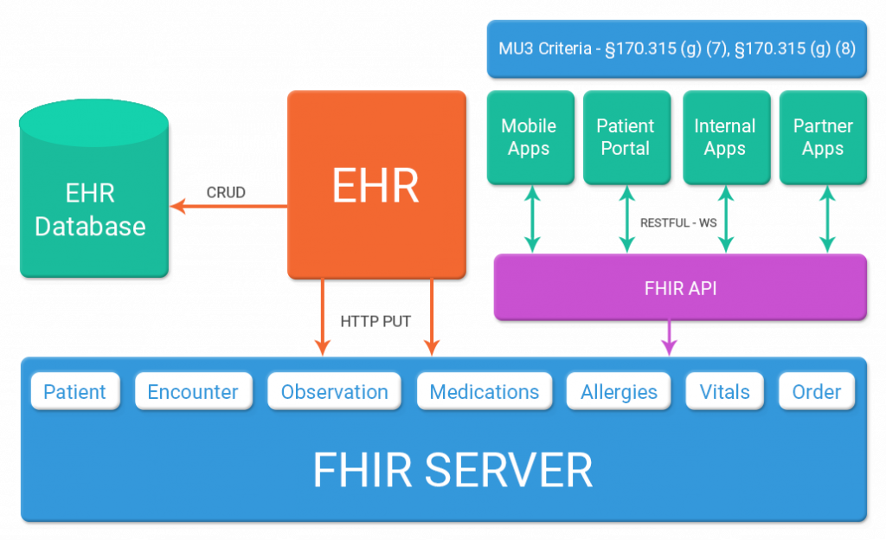

Stuff about FHIR

# Understanding FHIR: A Guide for Non-Technical Researchers in Human Genomics

## Introduction to FHIR

FHIR, or **Fast Healthcare Interoperability Resources**, is a standard developed by Health Level Seven International (HL7) to enable the electronic exchange of healthcare information. It addresses the challenge of interoperability in healthcare, ensuring that different systems can communicate and share data seamlessly. This is particularly important as healthcare records become increasingly digitised, and there is a need for standardised data that is available, discoverable, and understandable across various platforms.

## Problems FHIR Addresses

### Interoperability Challenges

One of the primary issues FHIR addresses is the lack of interoperability in healthcare IT systems. Traditionally, healthcare systems have used various proprietary formats and standards, making it difficult to exchange data between different systems. This lack of interoperability can lead to fragmented patient records, inefficiencies, and increased costs. FHIR provides a standardised framework for data exchange that is both simple and efficient, allowing for the integration of data from different sources.

### Data Quality and Standardisation

Healthcare organisations often have vast amounts of data stored in different formats and with varying levels of quality. FHIR helps ensure data quality and standardisation by defining clear data standards and validation processes. This standardisation is crucial for accurate and reliable data exchange, enabling healthcare providers to have a more complete view of a patient's medical history.

### Legacy System Integration

Many healthcare organisations rely on legacy systems that were not designed with interoperability in mind. FHIR facilitates the integration of these systems by providing middleware solutions or interoperability platforms that act as intermediaries, translating data formats and enabling seamless integration with FHIR-enabled applications.

### Security and Privacy

FHIR implementation requires careful consideration of security and privacy measures to protect patient health information. Organisations must adhere to industry best practices, such as using secure communication protocols, implementing authentication and authorisation mechanisms, and encrypting data at rest and in transit. Compliance with privacy regulations like HIPAA is essential to ensure the privacy of patient data.

## Basic Concepts of FHIR

#### Resources

- The building blocks of FHIR are called **Resources**. These are discrete units of data that represent specific healthcare concepts, such as patients, medications, or observations. Each resource is self-contained and can be combined with others to represent complex healthcare data. For example, in human genomic research, resources like **GenomicStudy** and **MolecularSequence** can capture detailed genomic information.

#### Datatypes, Profiles, and Extensions

**Datatypes**: FHIR uses DataTypes to define the kind of data that can be included in a resource. These range from simple types like strings and integers to complex types that hold structured data. 

**Profiles**: are sets of rules that constrain or extend resources to meet specific use cases, allowing for customisation while maintaining core standards. They place constraints on the core FHIR resources to more precisely define what should be captured within an Implementation Guide to better suit its use case.

**Extensions**: allow for the addition of new elements to resources or data types that are not part of the standard specification. This enables the customisation of FHIR resources to meet specific needs without deviating from the core standard.

#### RESTful API

FHIR utilises a RESTful API architecture, which is a set of rules for creating web services that allow different applications to communicate. This architecture is widely used in today's web services, making FHIR easy to implement and integrate with existing systems. Data is accessed and modified using standard web protocols like HTTP, and formats like JSON or XML. The HTTP-based RESTful protocol enables operations such as creating, reading, updating, and deleting data. This RESTful architecture allows FHIR resources to be accessed and manipulated through various applications, facilitating interoperability and integration across different healthcare systems.

#### Summary of Concepts

| Concept      | Description                                                                                       |
|--------------|---------------------------------------------------------------------------------------------------|
| Resources    | Discrete units of data representing specific healthcare concepts, such as patients or medications.|
| Datatypes    | Define the kind of data that can be included in a resource, ranging from simple to complex types.  |
| Profiles     | Sets of rules that constrain or extend resources to meet specific use cases.                      |
| Extensions   | Add new elements to resources or data types, allowing customisation while adhering to core standards. |
| RESTful API  | HTTP-based protocol for interacting with FHIR resources, enabling operations like create, read, update, and delete. |

## Use Cases for FHIR

### General Use Cases

- **Interoperability**: FHIR promotes interoperability by allowing healthcare systems to communicate and share data seamlessly, crucial for providing holistic patient care.
- **Patient Access**: It enables patients to access their medical records through APIs, complying with regulations like the CMS Interoperability and Patient Access Rule.
- **Clinical Decision Support**: FHIR supports decision-making processes by integrating real-time data into clinical workflows.

### Genomic Research Use Cases

- **Genomic Data Standardisation**: FHIR provides a framework for representing and exchanging complex genomic data, ensuring consistent communication across platforms.
- **Integration with EHRs**: FHIR facilitates the integration of genomic data into Electronic Health Records (EHRs), supporting precision medicine by providing a comprehensive view of patient health data.
- **Research and Data Harmonisation**: FHIR helps harmonise genomic data across research platforms, crucial for large-scale studies and collaborations.

## Implementation Guides

Implementation Guides (IGs) provide detailed instructions on implementing FHIR in specific contexts. In the Australian human genomic research field, guides like the **Clinical Picture FHIR Implementation Guide** and the **HL7 FHIR Implementation Guide: Genomics Reporting** help standardise genomic data representation and reporting. These guides ensure consistent data exchange, supporting research and clinical decision-making.

For those looking to explore more FHIR implementation guides, here are a couple of valuable resources:

- **Implementation Guide Registry**: A comprehensive registry of FHIR implementation guides can be found at [https://fhir.org/guides/registry/](https://fhir.org/guides/registry/). This registry provides access to a wide range of guides tailored to various use cases and regions.

- **Australian Base Implementation Guide**: For implementations specific to Australia, the Australian Base Implementation Guide is available at [http://hl7.org.au/fhir/4.0.0/index.html](http://hl7.org.au/fhir/4.0.0/index.html). This guide provides foundational standards and practices for FHIR implementations within the Australian context.

## Setting Up and Using FHIR

### Setting Up FHIR

To set up FHIR, you typically create a FHIR server, which acts as a repository for storing and managing healthcare data. This server can be hosted on a physical or virtual server, using technologies like Docker for easy deployment. Alternatively, you can integrate a FHIR interface with existing systems.

### Accessing and Modifying Data

Data is accessed using RESTful API calls, allowing you to retrieve, create, update, or delete resources. For example, you can use HTTP GET requests to access patient records. To modify FHIR to suit specific needs, you can use profiles and extensions to customise resources, ensuring they capture the necessary information for your research.

### Putting Data into FHIR

There are several ways to input data into FHIR:

- **Manual Entry**: Enter data directly using user interfaces or structured forms.
- **Automated Conversion**: Use data mapping tools or ETL pipelines to transform existing data into FHIR format and load it into the server.
- **FHIR APIs**: Use RESTful API calls to load data, including bulk operations for large datasets. This includes using HTTP PUT API calls to update or create resources in the FHIR server from **EHR databases**.
- **Specialised Tools**: Use tools like the Azure FHIR Converter to convert data from other formats into FHIR.

*Figure 1: Example setup of a FHIR server and interaction with EHR and health apps. Source: [Nalashaa Health Blog](https://blog.nalashaahealth.com/part-3-fhir-ehr-follow-fhir-path/)*

## A User Story: Setting Up and Using FHIR in Genomic Research

As a human genomics researcher, I was tasked with setting up a FHIR server to manage and analyse genomic data for our latest research project. Here's how I approached the task:

#### Step 1: Setting Up the FHIR Server

I started by setting up a FHIR server using HAPI FHIR, an open-source implementation. I opted to use Docker to simplify the deployment process. Docker allowed me to package the server application and its dependencies into a container, which I could easily deploy on our lab's virtual server.

#### Step 2: Applying an Implementation Guide

Next, I applied the **HL7 FHIR Implementation Guide: Genomics Reporting** to ensure that our genomic data was represented consistently. This guide provided detailed instructions on structuring genomic data, including variant reporting and pharmacogenomic data. By following the guide, I was able to create custom profiles and extensions to capture the specific genomic attributes needed for our research.

#### Step 3: Setting Up a Data Capture Interface

To facilitate data entry, I set up a user-friendly data capture interface using SMART on FHIR. This interface allowed our research team to input genomic data directly into the FHIR server. The interface was designed with structured forms that mapped directly to FHIR resources, ensuring data consistency and accuracy.

#### Step 4: Inputting Data into FHIR

We began inputting data into the FHIR server using a combination of manual entry and automated data conversion. For existing datasets, I used an ETL pipeline to transform the data into FHIR format and load it into the server. For new data, the research team used the data capture interface to enter information directly.

#### Step 5: Accessing and Analysing Data

With the data in place, I accessed it using FHIR's RESTful APIs. This allowed me to retrieve specific genomic study results and sequencing data as needed. I then transferred the data to our analytics platform, where I could perform detailed research analyses. The standardised FHIR format made it easy to integrate the data with our analytics tools, enabling us to conduct comprehensive genomic studies and derive meaningful insights.

## FHIR Implementation Guides for Human Genomics

The use of FHIR in the realm of Genomics is mainly in the domain of clinical genomics, though there are some investigations into its applicability in research settings (HERNANDEZ et al. 2022). The core of FHIR does not natively support genomics specific structured data. However, there have been several Implementation Guides that suit a more Genomics based use case:

- Australian Genomics’ Clinical Picture Repository Implementation Guide: [https://aehrc.github.io/genclipr-fhir-ig/index.html](https://aehrc.github.io/genclipr-fhir-ig/index.html)
- Genomics Reporting Implementation Guide: [http://hl7.org/fhir/uv/genomics-reporting/STU2/](http://hl7.org/fhir/uv/genomics-reporting/STU2/) (ALTEROVITZ et al. 2020)
- Phenopackets Implementation Guide: [http://phenopackets.org/core-ig/](http://phenopackets.org/core-ig/)

Given the complexity of genomics data, there has also been work to develop ‘genomic operations’ to allow for wrapping of genomic data repositories to integrate with electronic health records captured in FHIR (DOLIN et al. 2022).

There is ongoing work to improve the capture of genomic information in FHIR through the HL7 Clinical Genomics Workgroup (https://confluence.hl7.org/display/CGW) and GenomeX (https://confluence.hl7.org/display/COD/Genomics).

## Conclusion

FHIR is a powerful standard that transforms how healthcare data is exchanged and integrated, particularly in the field of human genomic research. By providing a standardised framework for data representation and exchange, FHIR enhances interoperability, supports precision medicine, and facilitates research collaborations. Understanding how to set up and use FHIR, and leveraging implementation guides, can significantly improve data management and utilisation in genomic research.

## Resources for Further Learning

To explore more about FHIR and its applications, here are some resources:

1. **HL7 FHIR Official Website**: Provides comprehensive documentation on FHIR standards and resources. [Visit HL7 FHIR](https://www.hl7.org/fhir/resourcelist.html).

1. **Australian Digital Health Agency Implementation Guide**: [https://developer.digitalhealth.gov.au/fhir/my-health-record/current/index.html](https://developer.digitalhealth.gov.au/fhir/my-health-record/current/index.html)

1. **Building Apps on FHIR Using SMART on FHIR**: Learn how to build applications on FHIR using the SMART on FHIR framework. This paper provides a comprehensive guide on developing SMART on FHIR apps, which can be integrated with FHIR servers to enhance healthcare data interoperability. [Read the paper](https://www.ncbi.nlm.nih.gov/pmc/articles/PMC4997036/)

1. **SMART on FHIR Webinar**: A good webinar for getting started with SMART on FHIR. [Watch the webinar](https://medblocks.com/fhirwebinar)

1. **How to Write a SMART Client for FHIR**: This tutorial by Cerner provides a step-by-step guide on how to develop a SMART on FHIR client. It covers the basics of SMART on FHIR, including authentication, authorisation, and how to interact with FHIR resources. [Read the tutorial](https://engineering.cerner.com/smart-on-fhir-tutorial/)

