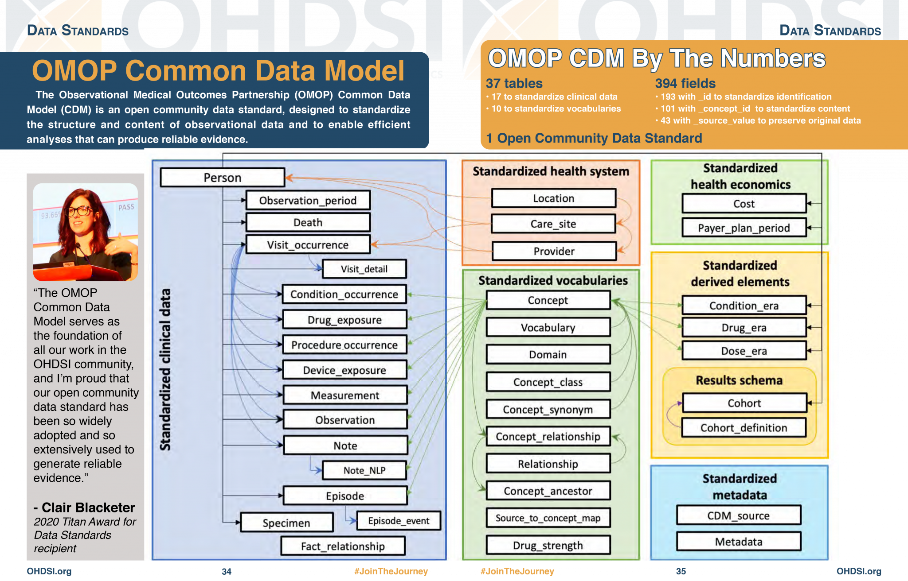

The Observational Medical Outcomes Partnership (OMOP) Common Data Model (CDM) is a standardised format for organising and analysing healthcare data from diverse sources. It was developed to address the challenges of working with heterogeneous observational databases in medical research.

## What is OMOP?

OMOP is an open-source data model that transforms disparate healthcare data into a common format and representation. It standardises the structure, format, and terminologies of otherwise inconsistent datasets, enabling systematic analysis across multiple data sources. For more information, visit the [OHDSI data standardisation page](https://www.ohdsi.org/data-standardization/).

## Problems OMOP Solves

OMOP addresses several key challenges in healthcare data management, providing solutions to common issues that researchers and healthcare professionals face when working with diverse datasets:

1. **Data Heterogeneity**: It harmonises data from various sources like electronic health records, claims databases, and registries.

2. **Interoperability**: OMOP facilitates data sharing and collaborative research across institutions and countries.

3. **Reproducibility**: By standardising data and analytics, OMOP enhances the reproducibility of research findings.

4. **Efficiency**: It reduces the time and cost associated with conducting multi-database studies.

5. **Data Quality**: OMOP includes tools for data quality assessment and improvement.

## Who Uses OMOP?

OMOP has gained widespread adoption across various sectors of the healthcare and research community. Its versatility and effectiveness have made it a valuable tool for a diverse range of stakeholders:

- Academic researchers
- Healthcare institutions
- Pharmaceutical companies
- Regulatory agencies (e.g., FDA, EMA)
- Health technology assessment (HTA) bodies

## How to Use OMOP

Implementing OMOP involves several key steps. These steps ensure that data is properly transformed, standardised, and ready for analysis within the OMOP framework:

1. **Data Conversion**: Transform your source data into the OMOP CDM format.
2. **Vocabulary Mapping**: Map local codes to standard OMOP vocabularies.
3. **Data Quality Checks**: Use OHDSI tools to assess data quality.
4. **Analysis**: Utilise standardised analytics tools like ATLAS for research.

### Summary of OMOP data categories and tables

| Category | Tables |
|----------|--------|
| Standardised Clinical Data | PERSON, OBSERVATION_PERIOD, VISIT_OCCURRENCE, CONDITION_OCCURRENCE, DRUG_EXPOSURE, PROCEDURE_OCCURRENCE, MEASUREMENT, OBSERVATION |
| Standardised Health System Data | CARE_SITE, PROVIDER |
| Standardised Health Economics | PAYER_PLAN_PERIOD, COST |
| Standardised Derived Elements | DRUG_ERA, DOSE_ERA, CONDITION_ERA, COHORT, COHORT_DEFINITION |
| Standardised Vocabularies | CONCEPT, VOCABULARY, DOMAIN, CONCEPT_CLASS, CONCEPT_RELATIONSHIP, RELATIONSHIP |
| Metadata | CDM_SOURCE, METADATA |

*Source: https://www.ohdsi.org/data-standardization/*

## Where to Find More Information

For those interested in learning more about OMOP or seeking resources for implementation and research, there are several valuable sources of information available:

- OHDSI website (www.ohdsi.org)
- The Book of OHDSI
- OMOP CDM GitHub repository
- OHDSI forums and community events

## OMOP's Impact on Medical Research Data Management

OMOP has significantly improved medical research data management in various ways, revolutionising how researchers approach large-scale observational studies:

1. **Enhancing Collaboration**: It enables large-scale, multi-site analyses and international research collaborations.

2. **Improving Data Utility**: OMOP allows researchers to leverage diverse data sources for more comprehensive studies.

3. **Standardising Analytics**: It provides a common platform for developing and sharing analytical tools.

4. **Protecting Privacy**: OMOP supports federated analyses, allowing researchers to run studies across multiple databases without sharing patient-level data.

5. **Accelerating Research**: By standardising data and methods, OMOP reduces the time from hypothesis to evidence generation.

In conclusion, the OMOP Common Data Model has become a crucial tool in observational health research, facilitating more efficient, collaborative, and reliable studies across diverse healthcare datasets. Its continued development and widespread adoption promise to further advance the field of medical research data management.