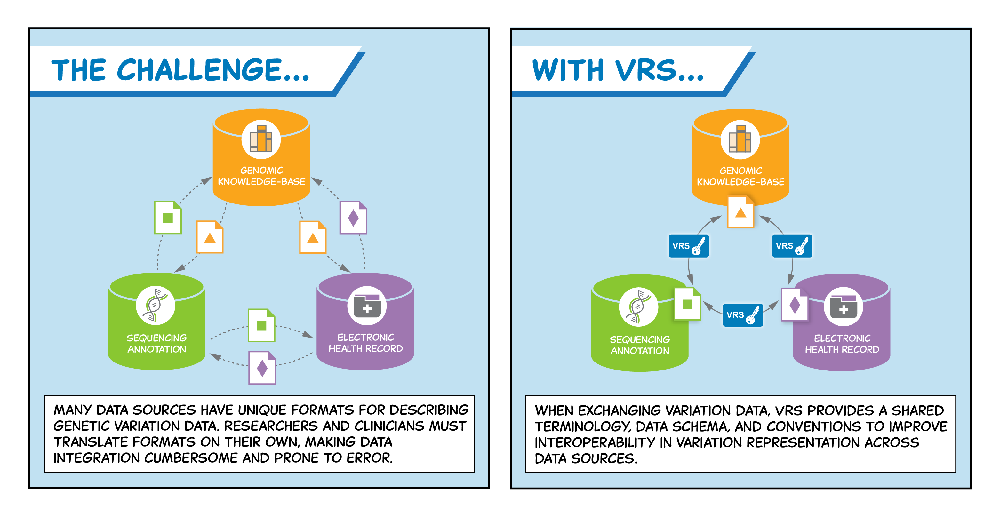

## Introduction to GA4GH VRS

The [**Variation Representation Specification (VRS)**](https://www.ga4gh.org/product/variation-representation/), pronounced "verse," is an open specification created by the [**Global Alliance for Genomics and Health (GA4GH)**](https://www.ga4gh.org/) and is now an established standard for the exchange of genetic variation data. It is developed through collaboration among national information resource providers, major public initiatives, and diagnostic testing laboratories. The primary goal of VRS is to enhance the personal, public, research, and clinical value of genomic information by ensuring reliable data exchange among clinicians, researchers, and testing laboratories.

## Problem Solved by VRS

The main problem addressed by VRS is the lack of a standardised method for representing genetic variation data. Without standardisation, the exchange and interpretation of genomic data can be inconsistent and unreliable. This inconsistency can hinder research efforts, clinical applications, and public health initiatives that rely on accurate genetic information.

*Borrowed from [GA4GH](https://www.ga4gh.org/product/variation-representation/)*

### Example of Inconsistency

Imagine two different laboratories analysing the same genetic sample but using different naming conventions for a specific gene variant. Laboratory A might refer to a variant as "BRCA1 c.68_69delAG," while Laboratory B uses "BRCA1 185delAG." Although both names describe the same genetic change—a deletion of two nucleotides in the BRCA1 gene—the lack of a standardised naming system leads to confusion. This inconsistency can result in difficulties when comparing results across studies or integrating data from multiple sources, potentially impacting patient care and research outcomes.

## Why VRS is Needed

VRS is needed to provide a consistent framework for the representation of genetic variations. By establishing precise computational definitions for biological concepts essential to representing sequence variation, VRS facilitates clear communication and understanding across different platforms and stakeholders in the genomic field. This standardisation is crucial for integrating genomic data into broader healthcare and research contexts.

## Overview of How VRS Works

VRS works by providing:

- **Terminology and Information Model**: It starts with precise computational definitions for biological concepts related to sequence variation. These definitions help represent knowledge accurately in fields, semantics, objects, and object relationships.
  
- **Machine Readable Schema**: The VRS information model is implemented using JSON Schema, with plans for compatibility with other schema systems such as XML, OpenAPI, and GraphQL. This machine-readable schema supports reliable information exchange.

- **Conventions for Data Sharing**: VRS recommends conventions that facilitate reliable data sharing, such as using fully justified allele normalisation.

- **Globally Unique Computed Identifiers**: It includes an algorithm for creating globally unique identifiers for molecular variations, allowing consistent identifier generation without a central authority.

## Design of VRS

The design of VRS includes several key components:

- **Precise Definitions**: To handle abstract or ambiguous biological terms accurately.
  
- **Schema Implementation**: Currently realised in JSON Schema but adaptable to other systems.

- **Data Sharing Conventions**: Recommendations that enhance the reliability of shared data.

- **Identifier Algorithm**: A specific algorithm for generating unique identifiers globally.

Additionally, there is a Python package available that demonstrates these schemas and algorithms. This package supports translating existing variant representation schemes into VRS formats for genomic data sharing.

## Hypothetical Scenario: Using VRS in Research

### Scenario Overview

Imagine a researcher, Dr. Smith, who is conducting a study to identify genetic variants associated with a rare hereditary disease. Dr. Smith collaborates with multiple laboratories worldwide, each contributing genomic data from their patient cohorts. The challenge is to ensure that all the data collected is consistent and interoperable, allowing for accurate analysis and comparison.

### Implementing VRS

To address these challenges, Dr. Smith decides to implement the GA4GH VRS in the research project:

- **Data Standardisation**: Dr. Smith uses VRS to standardise the representation of genetic variants across all collaborating laboratories. By adopting VRS's precise computational definitions and machine-readable schema, each lab can encode their data consistently, regardless of their original naming conventions or data formats.

- **Unique Variant Identification**: Using VRS's algorithm for generating globally unique computed identifiers, Dr. Smith ensures that each genetic variant is uniquely and unambiguously identified across all datasets. This prevents duplication and confusion when integrating data from different sources.

- **Data Sharing and Integration**: With VRS's conventions for data sharing, such as fully justified allele normalisation, Dr. Smith can seamlessly integrate data from various labs into a unified database. This facilitates comprehensive analysis and enhances the reliability of the study's findings.

- **Interoperability with Existing Systems**: By implementing VRS through its JSON Schema, Dr. Smith can easily interface with other genomic databases and tools that support VRS or are compatible with JSON Schema. This interoperability expands the potential for collaboration and data exchange beyond the initial research group.

### Outcome

By using VRS, Dr. Smith successfully harmonises genomic data from multiple sources, leading to more accurate and reliable identification of disease-associated variants. The standardised approach not only improves the quality of the research but also enhances collaboration with other researchers and clinicians who can now easily access and understand the shared data.

## Summary

In summary, GA4GH's Variation Representation Specification (VRS) addresses critical inconsistencies in genomic data representation by providing a standardised framework that enhances reliability and interoperability across various platforms. Through precise definitions, machine-readable schemas, and unique identifiers, VRS facilitates effective communication and integration of genetic variation data in research and clinical settings. This standardisation not only improves data quality but also fosters collaboration among global genomic communities.

## Resources:
- https://www.ga4gh.org/product/variation-representation/ - VRS GA4GH Info
- https://vrs.ga4gh.org/en/stable/introduction.html - VRS documentation
- https://github.com/ga4gh/vrs - VRS git repository
- https://www.sciencedirect.com/science/article/pii/S2666979X21000343 - VRS publication
- https://www.youtube.com/watch?v=5_Mgqwp1yXQ - VRS tutorial Video