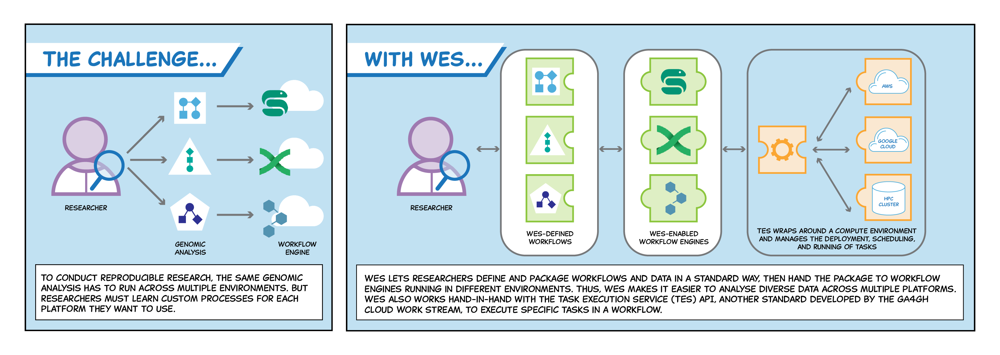

## What is the Workflow Execution Service (WES)?

The Workflow Execution Service (WES) by the Global Alliance for Genomics and Health (GA4GH) is designed to facilitate the execution and management of bioinformatics workflows in a standardised and reproducible manner. The WES provides an API that describes a standard protocol for running the same genomic data analysis in different environments and still obtaining the same results.

WES aims to enable interoperability among different bioinformatics systems, promoting collaboration and data sharing across research institutions and can be integrated with other GA4GH standards.

## References
- [GA4GH WES API](https://www.ga4gh.org/product/workflow-execution-service-wes/)
